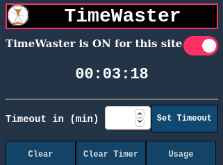
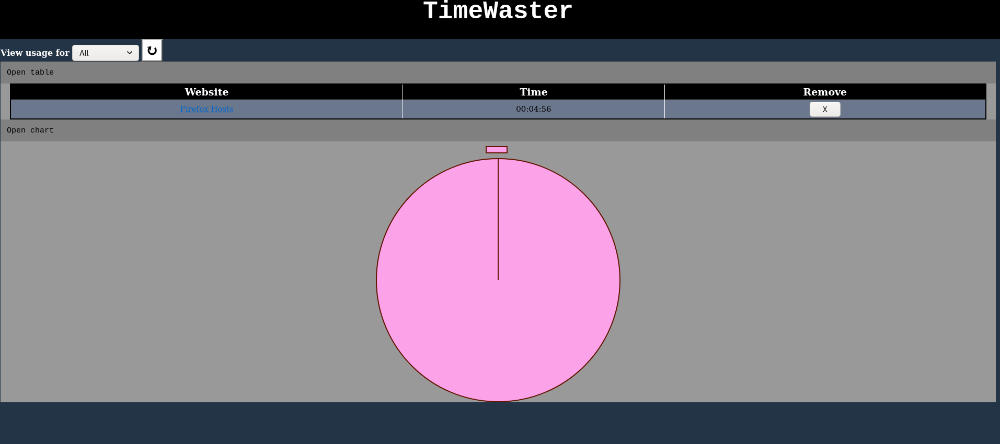

# timewaster-extension

  

Timewaster is a browser extension dedicated to providing productivity benefits for users by recording usage across browsing sessions. 
It is my quite simplistic endeavour into the world of web development or more specifically web extensions but has provided thorough insight and skills along the way.
This addon operates on the basics of CSS, HTML and Javascript, and displays time used on each host, with visual analysis integrated help from a library for graphing usages.

  

With the help of Charts.js, it was easy to integrate elegant graphing into the addon. Along with this an external page allows them to view usage statistics by day, week or by all. Clicking on the headings of the table allow you to sort them by increasing or decreasing order.

  

One mistake is that I haven't properly done testing and this is paramount in any project, something which I will try to get done as soon as possible. Thank you for all who give my first elementary venture in HTML, JS, and CSS some critique, time and all users of the addon (although it may be buggy, I apologise and will try my best to fix). 
